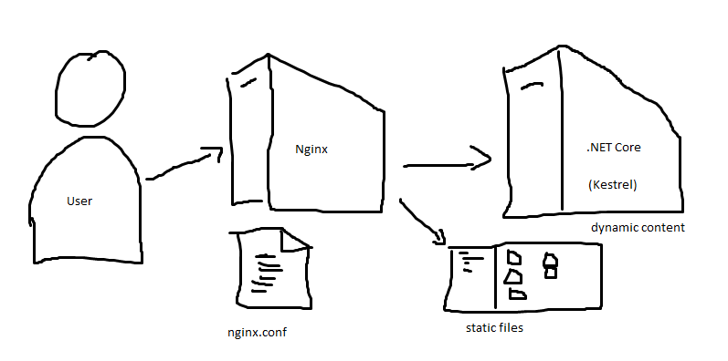

Nginx and .NET Core sample
==========================

This sample app demonstrates running .NET Core behind an Nginx reverse proxy.

Demo
----

I demoed this by creating all the content using demo-steps.txt

Usage
-----

Run `docker-compose up -d` then browse to [http://localhost:8080/](http://localhost:8080) to see the magic.

How it works
------------

Browser hits Nginx reverse proxy. If url is in /css/, /js/, /lib/, or /images/, it forwards to the static-content container.  All other urls forward to the dynamic-content container.

License
-------

MIT license, Copyright Richardson & Sons, LLC.
